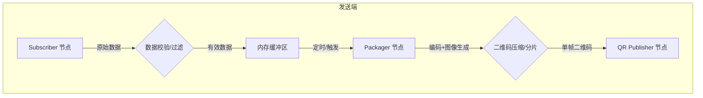
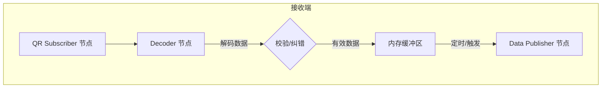

# QRcode_Communication
----

## 流程设计

```mermaid
graph 
    A[Subscriber 节点] -->|原始数据| A1{数据校验/过滤}
    A1 -->|有效数据| B[内存缓冲区]
    B -->|定时/触发| C[Packager 节点]
    C -->|编码+图像生成| C1{二维码压缩/分片}
    C1 -->|单帧二维码| D[QR Publisher 节点]
    
    subgraph 发送端
        A; A1; B; C; C1; D
    end
    
```

```mermaid
graph 
    E[QR Subscriber 节点]
    E --> F[Decoder 节点]
    F -->|解码数据| F1{校验/纠错}
    F1 -->|有效数据| G[内存缓冲区]
    G -->|定时/触发| H[Data Publisher 节点]
    subgraph 接收端
        E; F; F1; G; H
    end
```