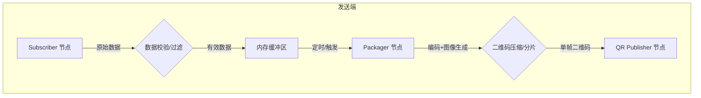
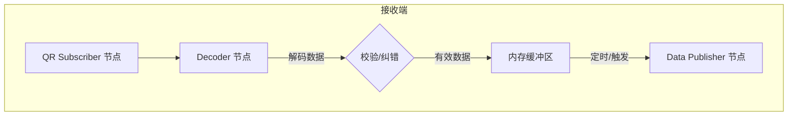

# QRcode_Communication
----

## 流程设计

## 流程介绍
rcoder.encoder(data):
- 输入：data，python基本类型
- 将data用msgpack转换为二进制数据
- 用zlib压缩二进制数据
- 使用base64转换为字符串
- 使用python内置的hash函数计算哈希值的绝对值，并与数据进行拼接
- 将拼接后的字符串写入qrcode
- 对qrcode转换为ros2通常支持的BGR8格式
- 返回图像

rcoder.decoder(img):
- 输入：img，ros2通常支持的BGR8格式的图像
- 从图像中提取qrcode
- 对qrcode进行解码
- 从解码后的字符串中提取哈希值和数据
- 用python内置的hash函数计算哈希值的绝对值，并与提取的哈希值进行比较
- 用base64转换为二进制数据
- 用zlib解压二进制数据
- 将解压后的二进制数据用msgpack转换为python基本类型
- 返回数据

