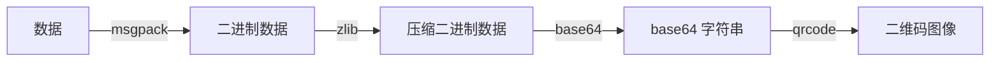

# 工作记录

## 2025.10.17
通过一周的讨论与合作，目前已经基本敲定了数据的编码形式，并完成了库的基本搭建。

----
二维码的解析部分，目前选用的是基于yolov8的qreader库，虽然这个库的识别效果相较于zbar与opencv更加精确，但在实际应用过程中受硬件的限制，实际有效识别距离仅有4m(二维码大小为16cm，level-10，图片4284*5712),且随着储存的数据量增加，识别距离还会进一步降低。

### 解决方案
- 使用手机作为识别器并使用微信开放平台的扫一扫SDK（支持自动变焦），解析后传回字符串。
- 购买可变焦摄像头，用于调整识别距离,但是需要重新写自动区域变焦算法。
  
  

